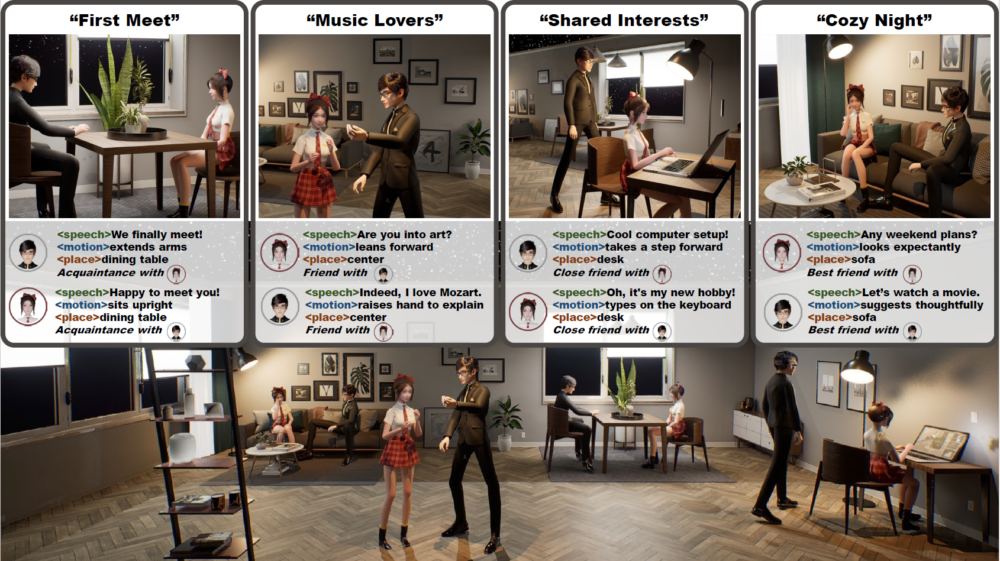

# Digital Life Project 



<div align="center">
    <b>Digital Life Project: Autonomous 3D Characters with Social Intelligence</b> 
    <br/>
    <a href="https://digital-life-project.com/" class="button"><b>[Homepage]</b></a> &nbsp;&nbsp;&nbsp;&nbsp;
    <a href="https://arxiv.org/abs/2312.04547" class="button"><b>[arXiv]</b></a> &nbsp;&nbsp;&nbsp;&nbsp;
    <a href="https://www.youtube.com/watch?v=rj0QEdGbSMs" class="button"><b>[Video]</b></a> &nbsp;&nbsp;&nbsp;&nbsp;
</div>

## News
- [2024-06-19] We have released the [SocioMind](https://github.com/AlanJiang98/DLP-SocioMind).
- [2024-06-19] We presented Digital Life Project at CVPR 2024.
- [2023-12-18] We have released the [MoMat-MoGen](https://github.com/mingyuan-zhang/FineMoGen?tab=readme-ov-file) with a **simplified** MoMat implementation.

## Directory

We release key component code and models to facilitate future research. 

|   Component    |    Status    |                                                                           Description                                                                           |  
|:--------------:|:------------:|:---------------------------------------------------------------------------------------------------------------------------------------------------------------:|
| Overall System | Proprietary  |                                                                           The framework that utilizes language as the universal medium to link SocioMind (the digital brain) and MoMat-Mogen (the digital body) to build autonomous 3D characters. **Not released**.                                                                          |
|   SocioMind    | Open-source  |                                     The meticulously crafted **digital brain** that models personalities with systematic few-shot exemplars, incorporates a reflection process based on psychology principles, and emulates autonomy by initiating dialogue topics. The code is released at [DLP-SocioMind](https://github.com/AlanJiang98/DLP-SocioMind).                                      |
|     MoMat-MoGen      | Partially Open-sourced  |                                              The text-driven motion synthesis paradigm for controlling the character’s **digital body**. It integrates *motion matching*, a proven industry technique to ensure motion quality, with cutting-edge advancements in *motion generation* for diversity. [MoMat-MoGen](https://github.com/mingyuan-zhang/FineMoGen?tab=readme-ov-file) consists of **a simplified implementation of MoMat** and has been released.                                               |      
|   DLP-MoCap    | Partially Open-sourced  | We used an optical MoCap system consisting of 30 cameras to capture body motions and inertial sensor-based MoCap gloves to track hand motions. The text annotations are **not released**. Nevertheless, [WHAC-A-Mole](https://wqyin.github.io/projects/WHAC/#whac-a-mole) contains videos synthesized with a subset of DLP-MoCap data and the corresponding SMPL-X sequences, and has been released.  |  

## Related Works

Our previous works below form the foundation of the Digital Life Project.
- [Story-to-Motion](https://story2motion.github.io/): Infinite Motion Synthesis from Long Text -> MoMat
- [ReMoDiffuse](https://mingyuan-zhang.github.io/projects/ReMoDiffuse.html): Retrieval-Augmented Motion Generation -> MoGen
- [SMPLer-X](https://caizhongang.github.io/projects/SMPLer-X/): Monocular Motion Capture Foundation Model -> Vision-based MoCap 

## Citation
```
@InProceedings{Cai_2024_CVPR,
    author    = {Cai, Zhongang and Jiang, Jianping and Qing, Zhongfei and Guo, Xinying and Zhang, Mingyuan and Lin, Zhengyu and Mei, Haiyi and Wei, Chen and Wang, Ruisi and Yin, Wanqi and Pan, Liang and Fan, Xiangyu and Du, Han and Gao, Peng and Yang, Zhitao and Gao, Yang and Li, Jiaqi and Ren, Tianxiang and Wei, Yukun and Wang, Xiaogang and Loy, Chen Change and Yang, Lei and Liu, Ziwei},
    title     = {Digital Life Project: Autonomous 3D Characters with Social Intelligence},
    booktitle = {Proceedings of the IEEE/CVF Conference on Computer Vision and Pattern Recognition (CVPR)},
    month     = {June},
    year      = {2024},
    pages     = {582-592}
}
```